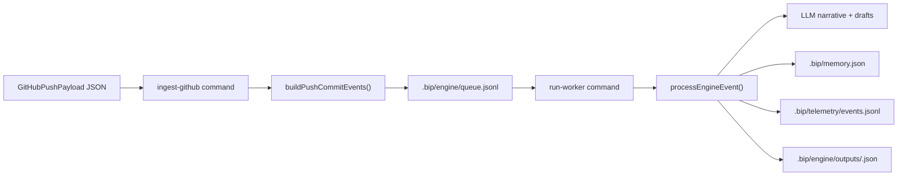

# Phase 2 Architecture (GitHub-first Engine)

This document is the implementation brief for Phase 2 foundation work:

- GitHub webhook ingestion
- Queue-based event processing
- Worker-driven narrative + draft generation
- Storage contracts for outputs and telemetry

## Scope

Phase 2 starts as a local-first engine in this repo:

1. Ingest a GitHub push payload file (`ingest-github`)
2. Convert each pushed commit into an engine event
3. Queue events in `.bip/engine/queue.jsonl`
4. Process with `run-worker` into `.bip/engine/outputs/<sha>.json`

This gives a stable data contract before adding hosted APIs and dashboard UI.

## Data flow

## Contracts

### Engine event (`EngineEvent`)

- `id`: deterministic source-scoped event id
- `source`: `github`
- `kind`: `push_commit`
- `repoFullName`: `owner/repo`
- `commitSha`: commit SHA
- `commitMessage`: commit message
- `branch`: branch name
- `occurredAt`: event timestamp
- `repoPath` (optional): local path where commit can be resolved

### Worker output

Each processed event stores:

- original event
- narrative JSON
- platform drafts
- telemetry estimates

Path: `.bip/engine/outputs/<shortSha>.json`

## Current implementation choices

- Queue: newline-delimited JSON file (simple, inspectable, easy to replace with SQS/RabbitMQ later)
- Worker: single-process FIFO consumer
- Failure handling: command error logging to `.bip/telemetry/events.jsonl`
- Continuity: memory context loaded from `.bip/memory.json`

## Next implementation tickets

1. Add webhook signature verification for hosted GitHub receiver.
2. Add retry + dead-letter behavior for failed events.
3. Add worker concurrency controls.
4. Add hosted storage abstraction for outputs/assets.
5. Expose outputs via API for dashboard consumption.
